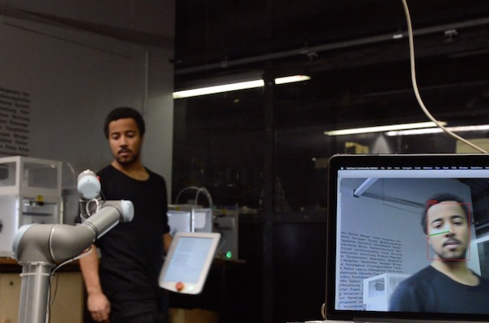
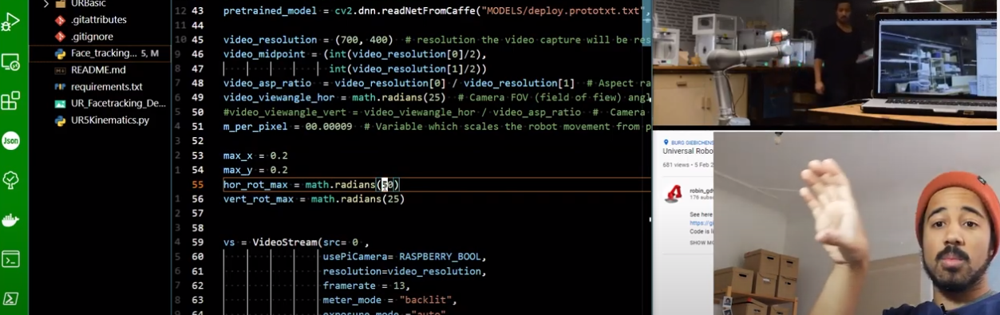

# UR_Facetracking

- [UR_Facetracking](#ur_facetracking)
  - [Demonstration](#demonstration)
  - [Usage](#usage)
      - [Settings](#settings)
  - [Explanation](#explanation)
  - [Requirements](#requirements)
  - [Notes](#notes)

Currently under developement as of 2021-03-14

Code is a bit of a mess **Use at your own risk**. 

 Universal Robot Realtime Facetracking with Python3 and OpenCV
 Uses the [UR - RTDE](https://www.universal-robots.com/how-tos-and-faqs/how-to/ur-how-tos/real-time-data-exchange-rtde-guide-22229/)- protocol to send continuous updates to a Robot for smooth continued motion.

## Demonstration
https://youtu.be/HHb-5dZoPFQ

## Usage

Run `Face_tracking01.py` to run the face tracking.
Developed for a Universal Robot UR5 CB running Polyscope 3.7

#### Settings

[ `robot_startposition`: ](https://github.com/robin-gdwl/UR_Facetracking/blob/95e271c1da55890cefa2645afeca3ea63f622a54/Face_tracking01.py#L35) The joint angles of the robot at the beginning.  
[`max_x , max_y `: ](https://github.com/robin-gdwl/UR_Facetracking/blob/95e271c1da55890cefa2645afeca3ea63f622a54/Face_tracking01.py#L53) The maximum horizontal distance the robot can travel.  
[`hor_rot_max, ver_rot_max`: ](https://github.com/robin-gdwl/UR_Facetracking/blob/95e271c1da55890cefa2645afeca3ea63f622a54/Face_tracking01.py#L55)Maximum Rotation of the robot at the edge of the view-window defined by `max_x` and `max_y`.  
[`m_per_pixel`](https://github.com/robin-gdwl/UR_Facetracking/blob/95e271c1da55890cefa2645afeca3ea63f622a54/Face_tracking01.py#L51): Distance (in meters) the robot will move to get to the position of the face in the captured image.  

## Explanation

https://youtu.be/9XCNE0BmtUg

The explanation is not comprehensive yet. A better Video is planned.  
___

## Requirements

Universal Robot or [URsim-software](https://www.universal-robots.com/download/?option=45440#section16597) (tested with UR5cb running polyscope 3.7)

python 3.x

**Python libraries:**  
[opencv-python 4.1.2.30](https://pypi.org/project/opencv-python/)   
[numpy 1.18.1](https://numpy.org/)  
[math3d 3.3.5](https://gitlab.com/morlin/pymath3d)   
[imutils 0.5.3](https://github.com/jrosebr1/imutils)  
[six 1.15.0](https://pypi.org/project/six/)

when used with a raspberry pi and picam:  
[picamera](https://picamera.readthedocs.io/en/release-1.13/)  
...  
___

## Notes

When using a linnux distribution or raspberry pi the software will try to use a picamera. If you want to use a webcam instead change it [here](https://github.com/robin-gdwl/UR_Facetracking/blob/master/Face_tracking01.py#L26).

heavily relies on this repository:
https://github.com/Mandelbr0t/UniversalRobot-RealtimeControl
which builds ontop of:
https://bitbucket.org/RopeRobotics/ur-interface/src/master/

License: GPLv3
___

TODO
- [ ] more testing
- [x] demonstration video
- [x] explanation video  (not the best explanation so far)
- [ ] License clarification
- [x] cleanup
- [ ] refactoring
- [ ] documentation
- [x] comments
- [x] add links to libraries and other resources
